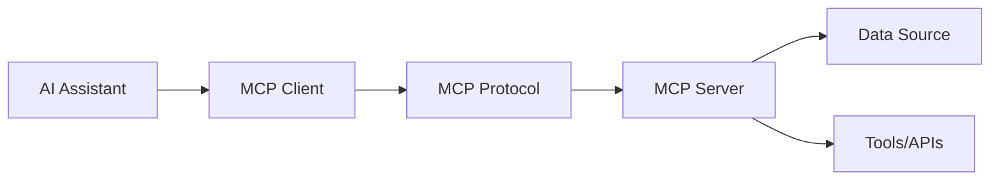

# What is the Model Context Protocol?

The **Model Context Protocol (MCP)** is an open standard that enables AI assistants to securely connect with external data sources and tools. Think of it as a universal adapter that allows AI systems to "plug into" various resources while maintaining security and user control.

## The Problem MCP Solves

Before MCP, AI assistants faced several challenges:

- **Data Silos**: Each data source required custom integration
- **Security Concerns**: No standardized way to control access
- **Development Overhead**: Building connectors was time-consuming
- **Inconsistent Interfaces**: Every integration worked differently

## How MCP Works

MCP introduces a standardized protocol that:

1. **Defines Common Interfaces**: Standard ways to access resources and tools
2. **Ensures Security**: Built-in authentication and permission controls
3. **Enables Discoverability**: AI assistants can discover available capabilities
4. **Supports Real-time**: Live data updates and event handling

## Key Benefits

### For AI Assistant Developers
- **Faster Integration**: Connect to multiple data sources with minimal code
- **Consistent Experience**: Same interface for all MCP-compatible resources
- **Security by Default**: Built-in security controls and user permissions

### For Data Providers
- **Broader Reach**: Make your data accessible to any MCP-compatible AI
- **Controlled Access**: Fine-grained permissions and access controls
- **Standard Implementation**: Follow established patterns and best practices

### For End Users
- **More Capable AI**: Access to richer, real-time data
- **Privacy Control**: Granular control over what data AI can access
- **Seamless Experience**: Unified interface across different data sources

## Real-World Use Cases

### Personal Productivity
- Connect AI to your calendar, email, and task management tools
- Access personal documents and notes
- Integrate with cloud storage services

### Business Intelligence
- Connect to databases and analytics platforms
- Access CRM and ERP systems
- Integrate with business intelligence tools

### Development Workflows
- Connect to code repositories and CI/CD systems
- Access development tools and documentation
- Integrate with project management platforms

### Research and Analysis
- Access academic databases and research papers
- Connect to data visualization tools
- Integrate with statistical analysis platforms

## Architecture Overview

MCP uses a client-server architecture:

- **MCP Client**: Embedded in AI assistants, handles protocol communication
- **MCP Server**: Provides access to specific resources or tools
- **MCP Protocol**: Standardized communication layer

## Getting Started

Ready to start using MCP? Here's what you need to know:

1. **[Core Concepts](/docs/01-CoreConcepts/overview)**: Understand the fundamental concepts
2. **[Quick Start](/docs/02-GettingStarted/quickstart)**: Get up and running in minutes
3. **[Examples](/docs/Appendix/examples)**: See real implementations

## Next Steps

Continue to the [Core Concepts](/docs/01-CoreConcepts/overview) section to learn about MCP's architecture and key components.
