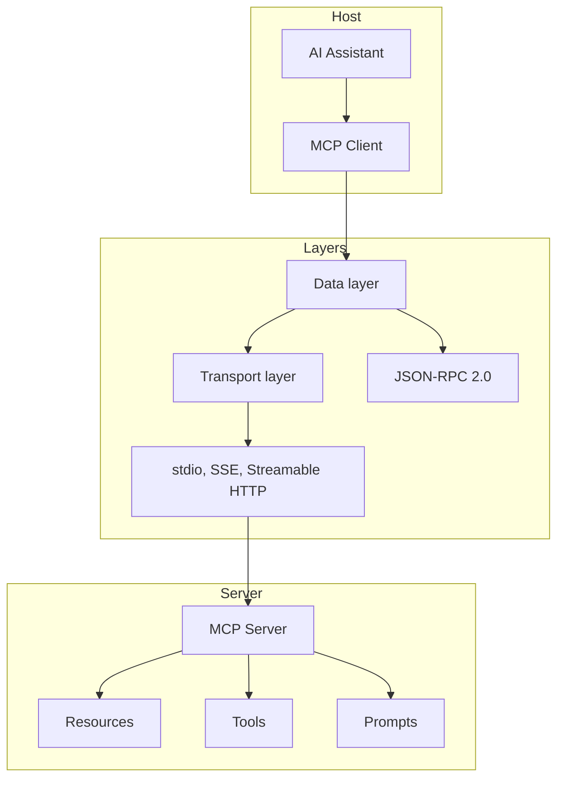

# Core Concepts

Understanding MCP's core concepts is essential for effectively implementing and using the protocol. This section covers the fundamental components and how they work together.


## Architecture Overview

MCP follows a client-server architecture with three main components:



## Participants

MCP involves three main participants that work together to enable AI assistants to access external resources and capabilities.

### 1. MCP Server

The **MCP Server** is the component that provides access to external resources, tools, and capabilities. It acts as a bridge between the AI assistant and various data sources or services.

#### 1.1 Resources
**Resources** are read-only data sources that servers expose to clients:

- **File Resources**: Access to local or remote files (documents, code, configurations)
- **Database Resources**: Query results from databases (SQL, NoSQL, graph databases)
- **API Resources**: Data from REST APIs, GraphQL endpoints, or web services
- **Document Resources**: Structured documents (PDFs, spreadsheets, presentations)
- **Media Resources**: Images, videos, audio files with metadata
- **Real-time Resources**: Live data feeds, sensor data, or streaming content

**Resource Characteristics:**
- Each resource has a unique URI for identification
- Resources include metadata (MIME type, description, annotations)
- Support for both text and binary content
- Can be dynamically discovered and updated

#### 1.2 Tools
**Tools** are executable functions that servers provide to perform actions:

- **Data Processing Tools**: Transform, filter, or analyze data
- **File Operations**: Create, modify, delete, or organize files
- **API Integration Tools**: Make HTTP requests, call external services
- **Database Operations**: Execute queries, update records
- **System Tools**: Run commands, manage processes, monitor resources
- **Communication Tools**: Send emails, notifications, or messages

**Tool Characteristics:**
- Defined with JSON Schema for input validation
- Can return structured results or error messages
- Support for both synchronous and asynchronous execution
- Include detailed descriptions and usage examples

#### 1.3 Prompts
**Prompts** are reusable prompt templates that standardize common AI interactions:

- **Analysis Prompts**: Templates for data analysis, code review, or content evaluation
- **Generation Prompts**: Templates for creating documents, code, or creative content
- **Workflow Prompts**: Multi-step processes for complex tasks
- **Domain-specific Prompts**: Specialized templates for specific industries or use cases

**Prompt Features:**
- Parameterized templates with variable substitution
- Support for different message roles (system, user, assistant)
- Can include context from resources or tool outputs
- Version control and template inheritance

### 2. MCP Host

The **MCP Host** is the runtime environment that manages MCP servers and facilitates communication between clients and servers.

**Key Responsibilities:**
- **Server Lifecycle Management**: Start, stop, and monitor MCP servers
- **Connection Brokering**: Establish and maintain connections between clients and servers
- **Security Enforcement**: Handle authentication, authorization, and access control
- **Resource Management**: Monitor server resource usage and performance
- **Configuration Management**: Load and validate server configurations
- **Error Handling**: Manage connection failures and server errors
- **Logging and Monitoring**: Track usage, performance metrics, and security events

**Host Types:**
- **Desktop Applications**: Claude Desktop, VS Code extensions
- **Web Applications**: Browser-based AI assistants
- **Server Applications**: Cloud-hosted AI services
- **Mobile Applications**: AI assistants on mobile devices

### 3. MCP Client

The **MCP Client** is embedded within AI assistants and handles all MCP protocol communication.

**Core Functions:**
- **Protocol Communication**: Manage JSON-RPC 2.0 message exchange
- **Resource Discovery**: Discover and catalog available resources
- **Tool Execution**: Execute server tools with proper error handling
- **Prompt Management**: Access and utilize server-provided prompts
- **Session Management**: Maintain persistent connections and state
- **Caching**: Cache resources and metadata for performance
- **Real-time Updates**: Handle server notifications and live data

**Client Capabilities:**
- Support for multiple concurrent server connections
- Automatic reconnection and failover handling
- Request queuing and rate limiting
- Response streaming for large datasets
- Offline mode with cached data

## 4. Layers

MCP is organized into distinct layers that separate concerns and enable flexibility in implementation.

### 4.1 Data Layer

The **Data Layer** defines how information is structured and exchanged between MCP components.

**Data Types:**
- **Resources**: Structured data with URIs, metadata, and content
- **Tools**: Function definitions with input schemas and execution logic
- **Prompts**: Template definitions with parameters and message structures
- **Messages**: JSON-RPC requests, responses, and notifications
- **Schemas**: JSON Schema definitions for validation and documentation

**Data Formats:**
- **JSON**: Primary format for structured data and protocol messages
- **Text**: Plain text, Markdown, code, and other text-based content
- **Binary**: Images, documents, archives, and other binary formats
- **Streaming**: Support for chunked data transfer and real-time updates

**Data Security:**
- Content validation and sanitization
- Size limits and resource quotas
- Encryption for sensitive data
- Access control and permissions

### 4.2 Transport Layer

The **Transport Layer** handles the actual communication between MCP clients and servers.

#### Stdio (Standard Input/Output)
**Stdio transport** uses standard input and output streams for communication:

**Characteristics:**
- **Simple Setup**: Easy to implement and debug
- **Process-based**: Each server runs as a separate process
- **Reliable**: Built on proven IPC mechanisms
- **Secure**: Inherits process security model
- **Local Only**: Limited to same-machine communication

**Use Cases:**
- Local development and testing
- Desktop applications
- Command-line tools
- Embedded systems

**Implementation:**
```javascript
const transport = new StdioServerTransport();
const server = new Server(config, capabilities);
await server.connect(transport);
```

#### SSE (Server-Sent Events)
**SSE transport** uses HTTP Server-Sent Events for real-time communication:

**Characteristics:**
- **Web-native**: Built on standard HTTP/HTTPS
- **Real-time**: Supports live data streaming
- **Firewall-friendly**: Uses standard HTTP ports
- **Scalable**: Can handle many concurrent connections
- **One-way**: Server-to-client communication only

**Use Cases:**
- Web applications
- Real-time dashboards
- Live data feeds
- Browser-based AI assistants

**Implementation:**
```javascript
const transport = new SSEServerTransport({
  port: 3000,
  path: '/mcp/events'
});
```

#### Streamable HTTP
**Streamable HTTP transport** uses HTTP with streaming support:

**Characteristics:**
- **Bidirectional**: Full request-response communication
- **Streaming**: Support for chunked transfer encoding
- **Stateless**: Each request is independent
- **Cacheable**: Can leverage HTTP caching mechanisms
- **Secure**: Built-in HTTPS support

**Use Cases:**
- Cloud services
- API gateways
- Microservices architecture
- High-throughput applications

**Implementation:**
```javascript
const transport = new HttpServerTransport({
  port: 3000,
  path: '/mcp',
  streaming: true
});
```

